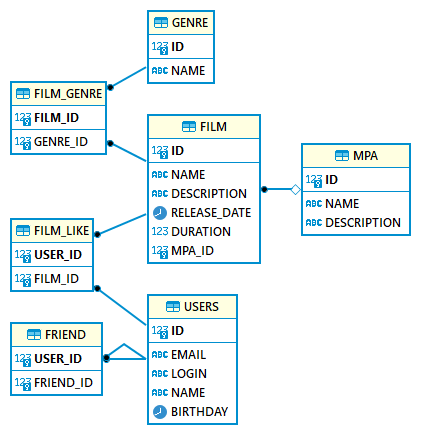

# Кинорейтинг - веб-сервис на Java, Spring Boot
Стек - Java, Spring Boot, JDBC, SQL, H2, REST API, JUnit

## О проекте
Соцсеть для кинолюбителей, можно добавлять пользователей в друзья, видеть с кем дружит друг и общих с ним друзей, просматривать любимые фильмы друзей, оценивать(лайкать) фильмы и получать подборку рекоменованных фильмов.

Версия с расширенным функционалом - https://github.com/gandistip/rate-movies-team

## Схема БД:

## Postman тесты
https://github.com/gandistip/rate-movies/blob/main/postman%20/tests.json
